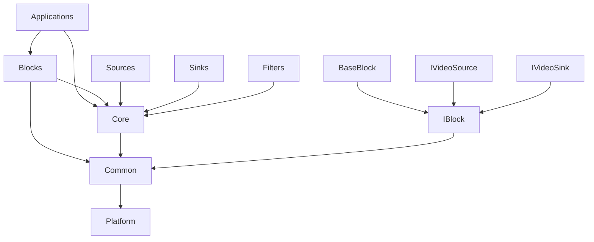

# Development and Contribution Guide

This guide provides comprehensive information for developers who want to contribute to or extend the video pipeline framework.

## Development Environment Setup

### Prerequisites

#### Required Tools
- **CMake**: 3.16 or higher
- **C++ Compiler**: GCC 8+, Clang 10+, or MSVC 2019+
- **Git**: For version control
- **Make**: For building

#### Optional Tools
- **Ninja**: Faster build system alternative to Make
- **ccache**: Compiler caching for faster rebuilds
- **clang-format**: Code formatting
- **clang-tidy**: Static analysis
- **valgrind**: Memory debugging (Linux)
- **gdb/lldb**: Debugging

### Environment Setup

#### 1. Clone and Build

```bash
# Clone repository
git clone <your-repo-url>
cd cameraCapture

# Create build directory
mkdir build && cd build

# Configure with development flags
cmake -DCMAKE_BUILD_TYPE=Debug \
      -DCMAKE_EXPORT_COMPILE_COMMANDS=ON \
      -DENABLE_TESTING=ON \
      -DENABLE_SANITIZERS=ON \
      ..

# Build
make -j$(nproc)
```

#### 2. Development Build Configuration

```cmake
# CMakePresets.json for development
{
    "version": 3,
    "configurePresets": [
        {
            "name": "dev-debug",
            "displayName": "Development Debug",
            "generator": "Ninja",
            "binaryDir": "build/debug",
            "cacheVariables": {
                "CMAKE_BUILD_TYPE": "Debug",
                "CMAKE_EXPORT_COMPILE_COMMANDS": "ON",
                "ENABLE_TESTING": "ON",
                "ENABLE_ASAN": "ON",
                "ENABLE_UBSAN": "ON"
            }
        },
        {
            "name": "dev-release",
            "displayName": "Development Release",
            "generator": "Ninja", 
            "binaryDir": "build/release",
            "cacheVariables": {
                "CMAKE_BUILD_TYPE": "RelWithDebInfo",
                "CMAKE_EXPORT_COMPILE_COMMANDS": "ON",
                "ENABLE_TESTING": "ON"
            }
        }
    ],
    "buildPresets": [
        {
            "name": "dev-debug",
            "configurePreset": "dev-debug"
        }
    ]
}
```

#### 3. Editor Configuration

##### VS Code (settings.json)
```json
{
    "C_Cpp.default.compileCommands": "build/compile_commands.json",
    "C_Cpp.default.cppStandard": "c++17",
    "C_Cpp.default.intelliSenseMode": "linux-gcc-x64",
    "files.associations": {
        "*.h": "cpp",
        "*.hpp": "cpp"
    },
    "cmake.configureOnOpen": true,
    "cmake.buildDirectory": "build"
}
```

##### Vim/Neovim
```lua
-- For nvim-lspconfig
require('lspconfig').clangd.setup({
    cmd = {
        "clangd",
        "--compile-commands-dir=build",
        "--header-insertion=iwyu",
        "--clang-tidy",
    }
})
```

## Code Organization

### Directory Structure

```
cameraCapture/
├── src/                     # Source files
│   ├── core/               # Core interfaces and base classes
│   │   ├── IBlock.hpp      # Main block interface
│   │   ├── IVideoSource.hpp # Source interface
│   │   ├── IVideoSink.hpp   # Sink interface
│   │   ├── BaseBlock.hpp    # Base implementation
│   │   ├── BaseBlock.cpp
│   │   └── ...
│   ├── blocks/             # Concrete block implementations
│   │   ├── sources/        # Source blocks
│   │   ├── sinks/          # Sink blocks
│   │   └── filters/        # Filter blocks (future)
│   ├── common/             # Shared utilities
│   │   ├── VideoFrame.hpp  # Frame representation
│   │   ├── BlockParams.hpp # Parameter handling
│   │   ├── Logger.hpp      # Logging utilities
│   │   └── ...
│   ├── apps/               # Applications
│   │   ├── pipeline_cli/   # Main CLI application
│   │   ├── examples/       # Example applications
│   │   └── tests/          # Test applications
│   └── platform/           # Platform-specific code
│       ├── linux/          # Linux implementations
│       ├── windows/        # Windows implementations
│       └── common/         # Cross-platform code
├── include/                # Public headers (if needed)
├── tests/                  # Unit tests
├── docs/                   # Documentation
├── examples/               # Example configurations
├── tools/                  # Development tools
└── CMakeLists.txt         # Build configuration
```

### Module Dependencies



## Coding Standards

### C++ Style Guidelines

#### 1. Naming Conventions

```cpp
// Classes: PascalCase
class VideoFrameProcessor {
public:
    // Public methods: PascalCase
    bool ProcessFrame(VideoFramePtr frame);
    
    // Private methods: PascalCase (same as public)
    void InitializeResources();
    
private:
    // Member variables: snake_case with trailing underscore
    std::mutex frame_mutex_;
    std::atomic<bool> is_running_;
    int frame_count_;
    
    // Static constants: kPascalCase
    static constexpr int kMaxFrameSize = 1920 * 1080 * 4;
};

// Functions: PascalCase
bool InitializePipeline(const std::string& config_path);

// Variables: snake_case
int current_frame_index = 0;
std::string input_file_path;

// Constants: kPascalCase
constexpr double kDefaultFrameRate = 30.0;

// Namespaces: snake_case
namespace video_pipeline {
namespace utils {
    // ...
}
}

// Macros: UPPER_SNAKE_CASE
#define VP_LOG_ERROR(msg) Logger::Log(LogLevel::Error, msg)
```

#### 2. Header Structure

```cpp
#pragma once

// System includes (alphabetical)
#include <atomic>
#include <memory>
#include <mutex>
#include <thread>

// Third-party includes
#include <opencv2/opencv.hpp>

// Project includes (alphabetical)
#include "common/BlockParams.hpp"
#include "common/VideoFrame.hpp"
#include "core/IVideoSink.hpp"

namespace video_pipeline {

/**
 * @brief Brief description of the class
 * 
 * Detailed description of what this class does, its purpose,
 * and any important usage notes.
 * 
 * @example
 * ```cpp
 * auto processor = std::make_shared<VideoFrameProcessor>();
 * if (processor->Initialize(params)) {
 *     processor->ProcessFrame(frame);
 * }
 * ```
 */
class VideoFrameProcessor : public IVideoSink {
public:
    // Constructor/Destructor
    VideoFrameProcessor();
    virtual ~VideoFrameProcessor();
    
    // Disable copy operations (if not needed)
    VideoFrameProcessor(const VideoFrameProcessor&) = delete;
    VideoFrameProcessor& operator=(const VideoFrameProcessor&) = delete;
    
    // Enable move operations
    VideoFrameProcessor(VideoFrameProcessor&&) = default;
    VideoFrameProcessor& operator=(VideoFrameProcessor&&) = default;
    
    // Interface methods
    bool Initialize(const BlockParams& params) override;
    void Shutdown() override;
    bool ProcessFrame(VideoFramePtr frame) override;
    
    // Public methods
    void SetProcessingMode(ProcessingMode mode);
    ProcessingMode GetProcessingMode() const;
    
private:
    // Private methods
    void WorkerThread();
    bool InitializeResources();
    void CleanupResources();
    
    // Member variables
    std::atomic<bool> is_running_{false};
    std::thread worker_thread_;
    std::mutex frame_mutex_;
    ProcessingMode processing_mode_{ProcessingMode::Default};
};

} // namespace video_pipeline
```

#### 3. Implementation Best Practices

```cpp
#include "VideoFrameProcessor.hpp"

#include <algorithm>
#include <chrono>

#include "common/Logger.hpp"

namespace video_pipeline {

VideoFrameProcessor::VideoFrameProcessor() {
    VP_LOG_DEBUG("VideoFrameProcessor created");
}

VideoFrameProcessor::~VideoFrameProcessor() {
    Shutdown();
    VP_LOG_DEBUG("VideoFrameProcessor destroyed");
}

bool VideoFrameProcessor::Initialize(const BlockParams& params) {
    // Validate parameters
    if (!ValidateParams(params)) {
        SetError("Invalid parameters");
        return false;
    }
    
    // Initialize resources with RAII
    try {
        InitializeResources();
    } catch (const std::exception& e) {
        SetError("Failed to initialize: " + std::string(e.what()));
        return false;
    }
    
    // Start worker thread
    is_running_ = true;
    worker_thread_ = std::thread(&VideoFrameProcessor::WorkerThread, this);
    
    return true;
}

void VideoFrameProcessor::Shutdown() {
    if (!is_running_) {
        return;
    }
    
    // Signal shutdown
    is_running_ = false;
    
    // Wait for worker thread
    if (worker_thread_.joinable()) {
        worker_thread_.join();
    }
    
    // Cleanup resources
    CleanupResources();
}

bool VideoFrameProcessor::ProcessFrame(VideoFramePtr frame) {
    // Validate input
    if (!frame || !is_running_) {
        return false;
    }
    
    // Performance timing
    auto start_time = std::chrono::high_resolution_clock::now();
    
    // Thread-safe processing
    {
        std::lock_guard<std::mutex> lock(frame_mutex_);
        
        // Process frame based on mode
        switch (processing_mode_) {
            case ProcessingMode::Fast:
                return ProcessFrameFast(frame);
            case ProcessingMode::Quality:
                return ProcessFrameQuality(frame);
            default:
                return ProcessFrameDefault(frame);
        }
    }
    
    // Update statistics
    auto end_time = std::chrono::high_resolution_clock::now();
    auto duration = std::chrono::duration_cast<std::chrono::microseconds>(
        end_time - start_time).count();
    
    UpdateStats(true, duration, false);
    
    return true;
}

} // namespace video_pipeline
```

#### 4. Error Handling

```cpp
// Use exceptions for constructor failures
class Resource {
public:
    Resource() {
        if (!Initialize()) {
            throw std::runtime_error("Failed to initialize resource");
        }
    }
};

// Use return codes for runtime operations
bool ProcessData(const Data& data) {
    if (!ValidateData(data)) {
        VP_LOG_ERROR("Invalid data provided");
        return false;
    }
    
    try {
        DoProcessing(data);
        return true;
    } catch (const std::exception& e) {
        VP_LOG_ERROR_F("Processing failed: {}", e.what());
        return false;
    }
}

// Use RAII for resource management
class SafeFileHandle {
public:
    explicit SafeFileHandle(const std::string& path) 
        : fd_(open(path.c_str(), O_RDONLY)) {
        if (fd_ == -1) {
            throw std::runtime_error("Failed to open file: " + path);
        }
    }
    
    ~SafeFileHandle() {
        if (fd_ != -1) {
            close(fd_);
        }
    }
    
    int get() const { return fd_; }
    
private:
    int fd_;
};
```

### Documentation Standards

#### 1. Class Documentation

```cpp
/**
 * @brief Video frame buffer with reference counting and metadata
 * 
 * The VideoFrame class represents a single frame of video data with
 * associated metadata such as timestamp, format, and dimensions. It
 * uses reference counting for efficient memory management and supports
 * zero-copy operations when possible.
 * 
 * Thread Safety: This class is not thread-safe. External synchronization
 * is required if the same instance is accessed from multiple threads.
 * 
 * Memory Management: Uses shared_ptr internally for automatic cleanup.
 * The underlying buffer is released when the last reference is destroyed.
 * 
 * @example Basic usage:
 * ```cpp
 * // Create frame with specific dimensions
 * auto frame = VideoFrame::Create(1920, 1080, PixelFormat::RGB24);
 * 
 * // Fill with data
 * uint8_t* data = frame->GetData();
 * FillWithTestPattern(data, frame->GetSize());
 * 
 * // Set metadata
 * frame->SetTimestamp(GetCurrentTimestamp());
 * frame->SetSequenceNumber(frame_counter++);
 * 
 * // Pass to processing pipeline
 * processor->ProcessFrame(frame);
 * ```
 * 
 * @example Zero-copy usage:
 * ```cpp
 * // Wrap existing buffer without copying
 * auto frame = VideoFrame::WrapBuffer(existing_data, size, 
 *                                     width, height, PixelFormat::RGB24);
 * 
 * // The frame now references the existing buffer
 * // Original data must remain valid for frame lifetime
 * ```
 * 
 * @note Frame data is immutable after creation. Use Clone() if modification
 *       is needed.
 * 
 * @warning The wrapped buffer in WrapBuffer() must remain valid for the
 *          entire lifetime of the VideoFrame instance.
 * 
 * @see IVideoSource for frame generation
 * @see IVideoSink for frame consumption
 * @see PixelFormat for supported formats
 * 
 * @since Version 1.0
 * @version 1.2 - Added zero-copy buffer wrapping
 */
class VideoFrame {
    // ...
};
```

#### 2. Method Documentation

```cpp
/**
 * @brief Process a video frame through the configured pipeline
 * 
 * This method takes ownership of the provided frame and processes it
 * according to the current configuration. The frame may be modified
 * during processing.
 * 
 * @param frame The video frame to process. Must not be null.
 *              The frame should contain valid data and metadata.
 * 
 * @return true if processing completed successfully
 * @return false if processing failed due to invalid input, resource
 *               constraints, or internal errors
 * 
 * @throws std::invalid_argument if frame is null
 * @throws std::runtime_error if critical processing error occurs
 * 
 * @pre frame must be non-null and contain valid data
 * @pre Processor must be initialized (Initialize() called successfully)
 * @post Frame may be modified during processing
 * @post Statistics are updated regardless of success/failure
 * 
 * @note This method is thread-safe and can be called concurrently
 *       from multiple threads.
 * 
 * @warning Large frames may cause memory pressure. Monitor memory
 *          usage in high-throughput scenarios.
 * 
 * @example
 * ```cpp
 * auto frame = source->GetNextFrame();
 * if (frame && processor->ProcessFrame(frame)) {
 *     VP_LOG_INFO("Frame processed successfully");
 * }
 * ```
 * 
 * @see Initialize() for setup requirements
 * @see GetStats() for performance metrics
 * 
 * @since Version 1.0
 */
bool ProcessFrame(VideoFramePtr frame);
```

## Testing Framework

### Unit Testing Structure

#### 1. Test Organization

```cpp
// tests/core/test_video_frame.cpp
#include <gtest/gtest.h>
#include <gmock/gmock.h>

#include "common/VideoFrame.hpp"
#include "test_utils/FrameTestUtils.hpp"

namespace video_pipeline {
namespace test {

class VideoFrameTest : public ::testing::Test {
protected:
    void SetUp() override {
        // Common setup for all tests
        test_width_ = 640;
        test_height_ = 480;
        test_format_ = PixelFormat::RGB24;
    }
    
    void TearDown() override {
        // Common cleanup
    }
    
    // Helper methods
    VideoFramePtr CreateTestFrame() {
        return VideoFrame::Create(test_width_, test_height_, test_format_);
    }
    
    void FillFrameWithPattern(VideoFramePtr frame, uint8_t pattern) {
        uint8_t* data = frame->GetData();
        std::fill(data, data + frame->GetSize(), pattern);
    }
    
    // Test data
    int test_width_;
    int test_height_;
    PixelFormat test_format_;
};

// Basic functionality tests
TEST_F(VideoFrameTest, CreateValidFrame) {
    auto frame = CreateTestFrame();
    
    ASSERT_NE(frame, nullptr);
    EXPECT_EQ(frame->GetWidth(), test_width_);
    EXPECT_EQ(frame->GetHeight(), test_height_);
    EXPECT_EQ(frame->GetFormat(), test_format_);
    EXPECT_NE(frame->GetData(), nullptr);
    EXPECT_GT(frame->GetSize(), 0);
}

TEST_F(VideoFrameTest, InvalidDimensions) {
    EXPECT_THROW(VideoFrame::Create(0, 480, PixelFormat::RGB24), 
                 std::invalid_argument);
    EXPECT_THROW(VideoFrame::Create(640, 0, PixelFormat::RGB24), 
                 std::invalid_argument);
    EXPECT_THROW(VideoFrame::Create(-1, 480, PixelFormat::RGB24), 
                 std::invalid_argument);
}

// Performance tests
TEST_F(VideoFrameTest, LargeFrameCreation) {
    const int large_width = 3840;
    const int large_height = 2160;
    
    auto start = std::chrono::high_resolution_clock::now();
    auto frame = VideoFrame::Create(large_width, large_height, PixelFormat::RGB24);
    auto end = std::chrono::high_resolution_clock::now();
    
    auto duration = std::chrono::duration_cast<std::chrono::milliseconds>(
        end - start).count();
    
    ASSERT_NE(frame, nullptr);
    EXPECT_LT(duration, 100); // Should create within 100ms
}

// Thread safety tests
TEST_F(VideoFrameTest, ConcurrentAccess) {
    auto frame = CreateTestFrame();
    FillFrameWithPattern(frame, 0xAA);
    
    std::atomic<int> completed_threads{0};
    std::vector<std::thread> threads;
    
    // Launch multiple reader threads
    for (int i = 0; i < 10; ++i) {
        threads.emplace_back([&frame, &completed_threads]() {
            // Read frame data multiple times
            for (int j = 0; j < 1000; ++j) {
                const uint8_t* data = frame->GetData();
                volatile uint8_t value = data[0]; // Prevent optimization
                (void)value;
            }
            completed_threads++;
        });
    }
    
    // Wait for all threads
    for (auto& t : threads) {
        t.join();
    }
    
    EXPECT_EQ(completed_threads.load(), 10);
}

} // namespace test
} // namespace video_pipeline
```

#### 2. Mock Objects

```cpp
// tests/mocks/MockVideoSink.hpp
#pragma once

#include <gmock/gmock.h>
#include "core/IVideoSink.hpp"

namespace video_pipeline {
namespace test {

class MockVideoSink : public IVideoSink {
public:
    MOCK_METHOD(bool, Initialize, (const BlockParams& params), (override));
    MOCK_METHOD(void, Shutdown, (), (override));
    MOCK_METHOD(bool, ProcessFrame, (VideoFramePtr frame), (override));
    
    MOCK_METHOD(std::string, GetName, (), (const, override));
    MOCK_METHOD(BlockState, GetState, (), (const, override));
    MOCK_METHOD(std::string, GetError, (), (const, override));
    
    MOCK_METHOD(BlockStats, GetStats, (), (const, override));
    MOCK_METHOD(void, ResetStats, (), (override));
};

} // namespace test
} // namespace video_pipeline
```

#### 3. Integration Tests

```cpp
// tests/integration/test_pipeline.cpp
#include <gtest/gtest.h>

#include "blocks/sources/TestPatternSource.hpp"
#include "blocks/sinks/FileSink.hpp"
#include "test_utils/TempFileManager.hpp"

namespace video_pipeline {
namespace test {

class PipelineIntegrationTest : public ::testing::Test {
protected:
    void SetUp() override {
        temp_file_manager_ = std::make_unique<TempFileManager>();
        output_path_ = temp_file_manager_->CreateTempFile();
    }
    
    void TearDown() override {
        // Cleanup handled by TempFileManager destructor
    }
    
    std::unique_ptr<TempFileManager> temp_file_manager_;
    std::string output_path_;
};

TEST_F(PipelineIntegrationTest, SourceToSinkDataFlow) {
    // Create source
    auto source = std::make_shared<TestPatternSource>();
    BlockParams source_params;
    source_params.SetParameter("width", "320");
    source_params.SetParameter("height", "240");
    source_params.SetParameter("fps", "1");
    source_params.SetParameter("pattern", "solid");
    
    ASSERT_TRUE(source->Initialize(source_params));
    
    // Create sink
    auto sink = std::make_shared<FileSink>();
    BlockParams sink_params;
    sink_params.SetParameter("path", output_path_);
    sink_params.SetParameter("format", "raw");
    
    ASSERT_TRUE(sink->Initialize(sink_params));
    
    // Connect and process frames
    const int frame_count = 10;
    for (int i = 0; i < frame_count; ++i) {
        auto frame = source->GenerateFrame();
        ASSERT_NE(frame, nullptr);
        ASSERT_TRUE(sink->ProcessFrame(frame));
    }
    
    sink->Shutdown();
    source->Shutdown();
    
    // Verify output file
    std::ifstream file(output_path_, std::ios::binary | std::ios::ate);
    ASSERT_TRUE(file.is_open());
    
    size_t file_size = file.tellg();
    size_t expected_size = 320 * 240 * 3 * frame_count; // RGB24
    EXPECT_EQ(file_size, expected_size);
}

} // namespace test
} // namespace video_pipeline
```

#### 4. Performance Benchmarks

```cpp
// tests/benchmarks/bench_video_frame.cpp
#include <benchmark/benchmark.h>
#include "common/VideoFrame.hpp"

namespace video_pipeline {
namespace benchmark {

static void BM_VideoFrameCreation(benchmark::State& state) {
    const int width = state.range(0);
    const int height = state.range(1);
    
    for (auto _ : state) {
        auto frame = VideoFrame::Create(width, height, PixelFormat::RGB24);
        benchmark::DoNotOptimize(frame);
        benchmark::ClobberMemory();
    }
    
    state.SetItemsProcessed(state.iterations());
    state.SetBytesProcessed(state.iterations() * width * height * 3);
}

BENCHMARK(BM_VideoFrameCreation)
    ->Args({640, 480})
    ->Args({1280, 720})
    ->Args({1920, 1080})
    ->Args({3840, 2160})
    ->Unit(benchmark::kMicrosecond);

static void BM_FrameDataAccess(benchmark::State& state) {
    auto frame = VideoFrame::Create(1920, 1080, PixelFormat::RGB24);
    uint8_t* data = frame->GetData();
    size_t size = frame->GetSize();
    
    for (auto _ : state) {
        // Simulate processing every pixel
        for (size_t i = 0; i < size; i += 3) {
            benchmark::DoNotOptimize(data[i]);
            benchmark::DoNotOptimize(data[i + 1]);
            benchmark::DoNotOptimize(data[i + 2]);
        }
    }
    
    state.SetBytesProcessed(state.iterations() * size);
}

BENCHMARK(BM_FrameDataAccess)
    ->Unit(benchmark::kMillisecond);

} // namespace benchmark
} // namespace video_pipeline

BENCHMARK_MAIN();
```

## Debugging Guide

### Common Debugging Scenarios

#### 1. Memory Leaks

```bash
# Run with AddressSanitizer
export ASAN_OPTIONS="detect_leaks=1:abort_on_error=1"
./build/pipeline_cli --config examples/simple.yaml

# Run with Valgrind
valgrind --tool=memcheck --leak-check=full --track-origins=yes \
         ./build/pipeline_cli --config examples/simple.yaml
```

#### 2. Thread Safety Issues

```bash
# Run with ThreadSanitizer
export TSAN_OPTIONS="halt_on_error=1:history_size=7"
./build/pipeline_cli --config examples/threaded.yaml

# Use Helgrind for race condition detection
valgrind --tool=helgrind ./build/pipeline_cli --config examples/threaded.yaml
```

#### 3. Performance Profiling

```bash
# CPU profiling with perf
perf record -g ./build/pipeline_cli --config examples/performance.yaml
perf report

# Memory profiling with heaptrack
heaptrack ./build/pipeline_cli --config examples/performance.yaml
heaptrack_gui heaptrack.pipeline_cli.*.gz
```

### Debug Logging

```cpp
// Enable debug logging at compile time
#ifdef DEBUG
    #define VP_DEBUG_ENABLED 1
#else
    #define VP_DEBUG_ENABLED 0
#endif

// Runtime debug level control
void SetDebugLevel(int level) {
    if (level >= 3) {
        VP_LOG_INFO("Enabling verbose debug output");
        Logger::SetLevel(LogLevel::Debug);
    } else if (level >= 2) {
        Logger::SetLevel(LogLevel::Info);
    } else if (level >= 1) {
        Logger::SetLevel(LogLevel::Warning);
    } else {
        Logger::SetLevel(LogLevel::Error);
    }
}
```

## Contributing Guidelines

### Pull Request Process

1. **Fork and Branch**
   ```bash
   git checkout -b feature/your-feature-name
   ```

2. **Code and Test**
   - Write tests for new functionality
   - Ensure all tests pass
   - Follow coding standards

3. **Commit Messages**
   ```
   feat: add H.264 video source support
   
   - Implement H264VideoSource class
   - Add FFmpeg integration for decoding
   - Include comprehensive unit tests
   - Update documentation
   
   Resolves #123
   ```

4. **Pull Request**
   - Provide clear description
   - Reference related issues
   - Include performance impact analysis
   - Add documentation updates

### Code Review Checklist

#### Functionality
- [ ] Code works as intended
- [ ] Edge cases are handled
- [ ] Error conditions are properly managed
- [ ] Thread safety is maintained

#### Performance
- [ ] No unnecessary memory allocations
- [ ] Efficient algorithms used
- [ ] No performance regressions
- [ ] Resource cleanup is proper

#### Code Quality
- [ ] Follows coding standards
- [ ] No code duplication
- [ ] Clear and readable
- [ ] Properly documented

#### Testing
- [ ] Unit tests provided
- [ ] Integration tests updated
- [ ] Test coverage is adequate
- [ ] Performance tests included

### Release Process

1. **Version Bumping**
   - Update version numbers
   - Update changelog
   - Tag release

2. **Testing**
   - Run full test suite
   - Performance regression testing
   - Platform compatibility testing

3. **Documentation**
   - Update API documentation
   - Update user guides
   - Release notes

This development guide should help maintain code quality and facilitate contributions to the video pipeline framework.